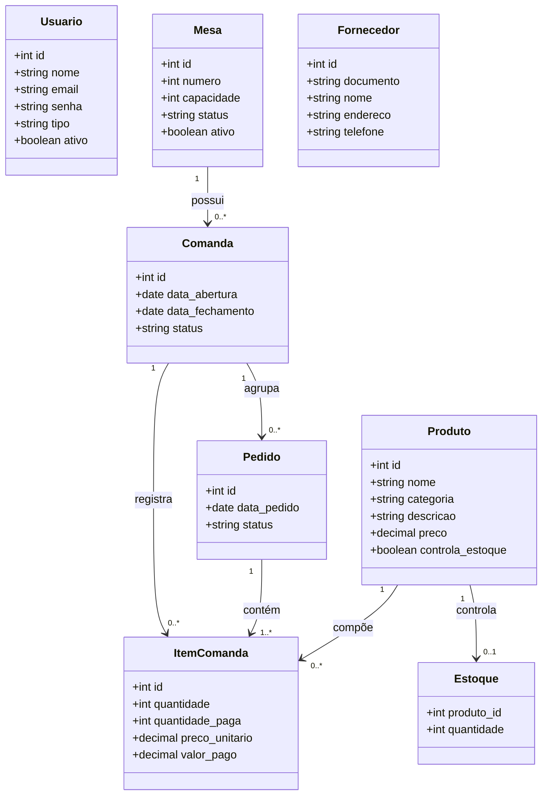

# Don Cabrón — Sistema de Gestão para Restaurante

Aplicação web para apoiar a operação de restaurantes: cardápio, mesas, comandas, pedidos, cozinha, estoque, fornecedores e usuários.

> Projeto acadêmico de Estágio Supervisionado. A documentação descreve a implementação atual.

## Funcionalidades

- **Cardápio:** consulta e exibição de produtos por categoria, com imagem, descrição e preço; tema claro/escuro e menu responsivo.
- **Mesas:** cadastro, listagem, edição, desativação e reativação de mesas. Mesas ocupadas não podem ser editadas, desativadas ou reativadas indevidamente.
- **Comandas:** abertura transacional de mesa e comanda; uma mesa ocupada recupera sua comanda aberta.
- **Pedidos:** inclusão e soma de itens em pedido pendente, confirmação e envio para a cozinha.
- **Cozinha:** consulta de pedidos e progressão controlada de status: `RECEBIDO` → `EM_PREPARO` → `PRONTO`.
- **Fornecedores:** cadastro e busca por nome ou documento, com prevenção de documentos duplicados.
- **Estoque:** consulta de saldo; a rota legada de inclusão direta na comanda verifica e reduz o estoque quando o produto é controlado.
- **Usuários:** login, criação/listagem de funcionários e ativação/desativação de contas pela área administrativa.

## Tecnologias

| Camada | Tecnologias |
| --- | --- |
| Front-end | HTML5, CSS3 e JavaScript puro (ES6+) |
| Back-end | Node.js, Express 5 e CommonJS |
| Banco de dados | MySQL com `mysql2/promise` e pool de conexões |
| Integração | API REST com JSON e `fetch` |
| Configuração | `dotenv` e variáveis de ambiente |
| Dependências principais | `express`, `cors`, `mysql2`, `bcryptjs`, `jsonwebtoken`, `dotenv` |

## Segurança

O sistema utiliza os seguintes mecanismos de segurança:

- **JWT (JSON Web Token)** para autenticação de usuários.
- **bcrypt** para proteção de senhas.
- **RBAC (controle de acesso baseado em papéis)** para autorização por tipo de usuário.
- **Consultas SQL parametrizadas** para proteção contra injeção de SQL.

## Regras de negócio

- Números de mesa e documentos de fornecedor são únicos.
- Uma mesa começa como `LIVRE`; ao abrir uma comanda passa a `OCUPADA`.
- A abertura de mesa é transacional e reutiliza uma comanda aberta quando ela já existe.
- Itens só podem ser adicionados a comandas abertas e devem ter quantidade maior que zero.
- Um pedido só pode ser confirmado se estiver `PENDENTE` e possuir itens.
- Transições da cozinha respeitam a sequência de status definida.
- Funcionários inativos não conseguem realizar login.

## Estrutura

```text
.
├── DonCabron/
│   ├── BackEnd/
│   │   ├── config/database.js    # conexão MySQL
│   │   ├── middleware/auth.js    # JWT e autorização por perfil
│   │   ├── routes/               # rotas da API
│   │   └── server.js             # servidor Express
│   ├── css/                      # estilos das telas
│   ├── img/                      # imagens e identidade visual
│   └── index/                    # páginas HTML
└── js/                           # scripts do front-end
```

## API principal

Base local: `http://localhost:3000`.

| Área | Rotas principais |
| --- | --- |
| Autenticação | `POST /auth/login`, `POST /auth/usuarios`, `GET /auth/usuarios`, `PATCH /auth/usuarios/:id/status` |
| Produtos e estoque | `GET /produtos`, `GET /estoque` |
| Fornecedores | `GET /fornecedores?busca=`, `POST /fornecedores` |
| Mesas | `GET/POST /mesas`, `PUT /mesas/:id`, `PATCH /mesas/:id/desativar`, `PATCH /mesas/:id/reativar`, `POST /mesas/:id/abrir` |
| Comandas e pedidos | `POST /comandas`, `POST /comandas/:comanda_id/itens`, `GET /comandas/:comanda_id/itens`, `PUT /comandas/:comanda_id/pedido/:pedido_id/confirmar` |
| Cozinha | `GET /comandas/cozinha/pedidos`, `PUT /comandas/cozinha/pedido/:pedido_id/preparo`, `PUT /comandas/cozinha/pedido/:pedido_id/pronto` |

As rotas administrativas exigem token JWT e perfil `ADMIN`.

## Modelo de dados

O banco utiliza as entidades `usuarios`, `produtos`, `estoque`, `fornecedores`, `mesas`, `comandas`, `pedidos` e `itens_comanda`.

Relações principais: `mesa 1:N comanda`, `comanda 1:N pedido`, `pedido 1:N item_comanda` e `produto 1:N item_comanda`.

## Diagrama de classes



## Requisitos funcionais por página

### Cardápio (`index.html`)

- **RF01:** Exibir os produtos cadastrados, com imagem, nome, descrição e preço.
- **RF02:** Organizar os produtos por categoria: comidas, bebidas alcoólicas, bebidas gaseificadas e artesanais.
- **RF03:** Permitir alternância entre tema claro e escuro.
- **RF04:** Disponibilizar navegação responsiva pelas páginas do sistema.

### Login (`login.html`)

- **RF05:** Permitir que o usuário informe e-mail e senha para autenticação.
- **RF06:** Direcionar o usuário para a área compatível com seu perfil após login válido.
- **RF07:** Informar ao usuário quando as credenciais forem inválidas.

### Mesas (`mesas.html`)

- **RF08:** Cadastrar mesas com número e capacidade.
- **RF09:** Listar mesas cadastradas e seus status.
- **RF10:** Alterar os dados de mesas livres e ativas.
- **RF11:** Desativar e reativar mesas conforme as regras de negócio.
- **RF12:** Abrir ou recuperar a comanda de uma mesa e direcionar ao pedido.

### Pedidos (`pedidos.html`)

- **RF13:** Exibir o cardápio para a mesa selecionada.
- **RF14:** Adicionar produtos e ajustar suas quantidades em um pedido.
- **RF15:** Exibir os itens que estão em montagem e os já enviados.
- **RF16:** Confirmar o pedido e enviá-lo para a cozinha.
- **RF17:** Consultar e atualizar o andamento dos pedidos na cozinha.

### Fornecedores (`fornecedor.html`)

- **RF18:** Cadastrar fornecedor com documento, nome, endereço, bairro, cidade e telefone.
- **RF19:** Validar CPF/CNPJ e telefone antes do envio do cadastro.
- **RF20:** Pesquisar fornecedores por nome ou documento.
- **RF21:** Informar conflitos quando o documento já estiver cadastrado.

### Usuários (`usuarios.html`)

- **RF22:** Permitir que administradores cadastrem funcionários.
- **RF23:** Listar funcionários cadastrados e seus respectivos perfis.
- **RF24:** Ativar ou desativar contas de funcionários.
- **RF25:** Restringir as operações administrativas a usuários autorizados.

## Status

Em desenvolvimento. Ainda não há suíte automatizada de testes ou script SQL versionado no repositório.
