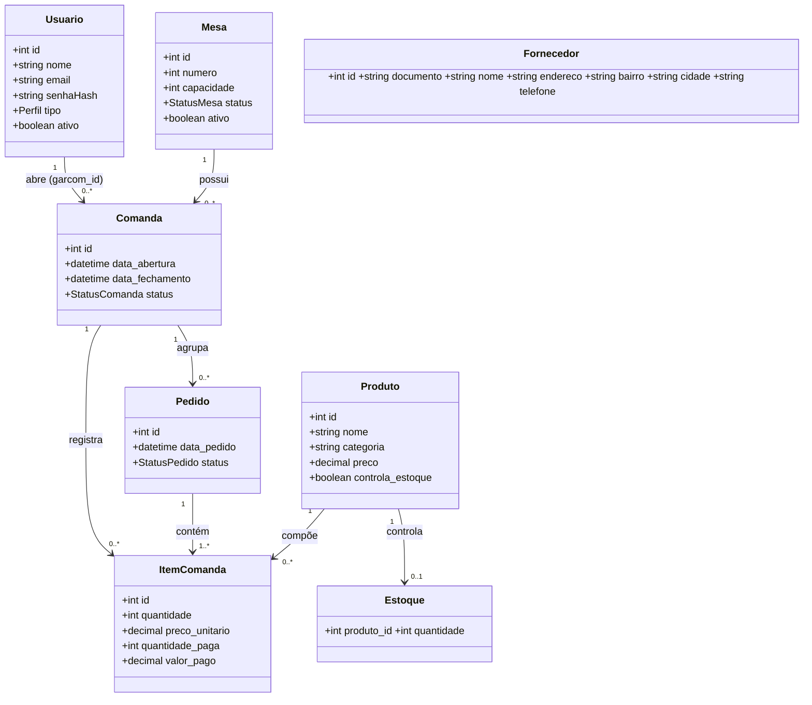
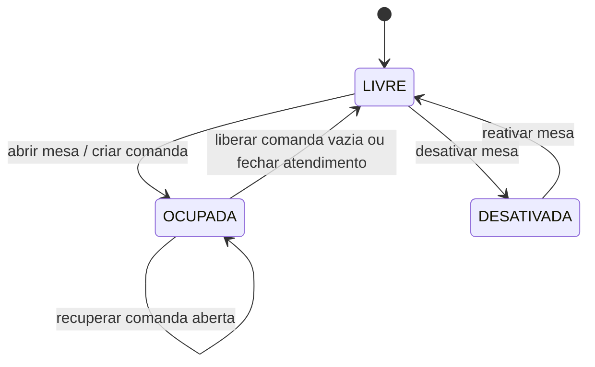
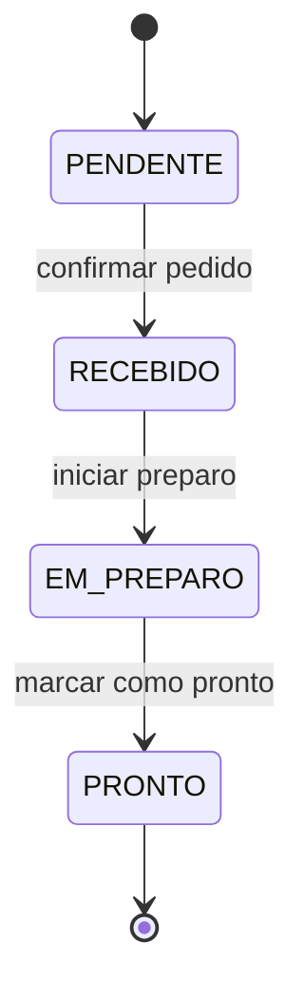

# Don Cabrón — Sistema de Gestão para Restaurante

Aplicação web para gestão operacional de restaurante, desenvolvida como projeto acadêmico de Estágio Supervisionado. O projeto organiza o ciclo de operação entre administração, atendimento e cozinha, com uma API REST em Node.js/Express, banco MySQL e front-end em HTML, CSS e JavaScript puro.

## Visão técnica

| Camada | Implementação |
| --- | --- |
| Front-end | HTML5, CSS3 responsivo e JavaScript ES6+ sem framework |
| Back-end | Node.js, Express 5 e CommonJS |
| Persistência | MySQL com `mysql2/promise` e pool de conexões |
| API | REST/JSON, com `fetch` no cliente |
| Autenticação | JWT assinado e armazenado na sessão do navegador |
| Autorização | RBAC por perfil: `ADMIN`, `GARCOM` e `COZINHA` |
| Senhas | Hash com `bcryptjs` |
| PDF | jsPDF e AutoTable na área de relatórios |

## Funcionalidades implementadas

### Operação e cadastros

- Cardápio com produtos organizados por categoria, imagem, descrição e preço.
- Mesas com cadastro, alteração, ativação, desativação e validações de status.
- Abertura transacional de comandas para mesas livres e recuperação de comandas abertas.
- Pedidos pendentes, inclusão e soma de itens, confirmação e envio para a cozinha.
- Quadro de produção com atualização periódica e fluxo de status controlado.
- Cadastro e busca de fornecedores, com prevenção de documento duplicado.
- Gestão de funcionários: criação, listagem e ativação/desativação.
- Consulta de produtos e suporte ao estoque controlado.

### Perfis e navegação

- `ADMIN`: acesso administrativo completo, incluindo cadastros, cozinha e relatórios.
- `GARCOM`: acesso restrito a mesas e pedidos; não acessa início, cadastros, relatórios ou cozinha.
- `COZINHA`: acesso restrito ao quadro de produção.
- Proteção de páginas no cliente, redirecionamento por perfil e proteção equivalente nas rotas sensíveis da API.
- Logout, menu responsivo, submenu administrativo e temas claro/escuro nas telas atualizadas.

### Relatórios

- Relatório de itens mais vendidos, filtrável por item específico ou todos os itens e por período.
- Relatório de atendimentos por garçom, filtrável por garçom específico ou todos e por período.
- Exportação em PDF com título, tabela, identidade visual Don Cabrón e numeração de páginas.
- Registro do garçom responsável nas novas comandas, possibilitando o ranking de atendimentos.

> Comandas anteriores à migração `001_adiciona_garcom_na_comanda.sql` não possuem vínculo histórico com garçom e podem aparecer como **Não informado** nos relatórios.

## Regras de negócio implementadas

- Número de mesa e documento de fornecedor são únicos.
- Mesa ativa livre pode ser aberta; ao abrir, seu status passa para `OCUPADA`.
- Mesas ocupadas não podem ser editadas ou desativadas.
- Uma comanda é aberta de forma transacional para evitar duplicidade de atendimento.
- Itens só podem ser incluídos em comandas abertas e com quantidade válida.
- Um pedido só é enviado à cozinha se estiver pendente e possuir itens.
- O fluxo da cozinha não permite saltar estados.
- Funcionários inativos não autenticam no sistema.
- Apenas administradores criam, listam ou alteram o status de funcionários.

## Segurança aplicada

| Controle | Implementação atual |
| --- | --- |
| Autenticação | Token JWT emitido no login e validado pelo middleware `autenticar` |
| Senhas | Comparação por hash `bcrypt`; senhas não são retornadas pela API |
| Autorização | Middleware `permitir(...perfis)` em operações restritas |
| Menor privilégio | Menus, páginas e endpoints são limitados ao perfil necessário |
| SQL Injection | Consultas parametrizadas com placeholders do MySQL |
| Sessão | Token e dados mínimos do perfil em `sessionStorage`; limpeza no logout/expiração |
| Dados administrativos | Rotas de usuários e relatórios exigem `ADMIN` |
| Integridade operacional | Transações e bloqueios no fluxo de abertura de mesas/comandas |
| Validação | Campos obrigatórios, estados permitidos, quantidades e conflitos de unicidade verificados no servidor |
| Configuração | Credenciais e chave JWT mantidas em variáveis de ambiente via `dotenv` |

## Estrutura do projeto

```text
.
├── DonCabron/
│   ├── BackEnd/
│   │   ├── config/database.js
│   │   ├── middleware/auth.js
│   │   ├── migrations/
│   │   ├── routes/
│   │   └── server.js
│   ├── css/
│   ├── img/
│   └── index/
├── js/
└── README.md
```

## API principal

Base local: `http://localhost:3000`.

| Área | Endpoints principais |
| --- | --- |
| Autenticação | `POST /auth/login`, `POST /auth/usuarios`, `GET /auth/usuarios`, `PATCH /auth/usuarios/:id/status` |
| Produtos e estoque | `GET /produtos`, `GET /estoque` |
| Fornecedores | `GET /fornecedores?busca=`, `POST /fornecedores` |
| Mesas | `GET/POST /mesas`, `PUT /mesas/:id`, `PATCH /mesas/:id/desativar`, `PATCH /mesas/:id/reativar`, `POST /mesas/:id/abrir` |
| Comandas e pedidos | `POST /comandas`, rotas de itens e confirmação de pedido |
| Cozinha | consulta de pedidos e transições para preparo/pronto |
| Relatórios | `GET /relatorios/produtos`, `GET /relatorios/atendimentos`, `GET /relatorios/garcons` |

## Modelo de domínio


```mermaid
classDiagram
    class Usuario {
        +int id
        +string nome
        +string email
        +string senhaHash
        +Perfil tipo
        +boolean ativo
    }
    class Mesa {
        +int id
        +int numero
        +int capacidade
        +StatusMesa status
        +boolean ativo
    }
    class Comanda {
        +int id
        +datetime data_abertura
        +datetime data_fechamento
        +StatusComanda status
    }
    class Pedido {
        +int id
        +datetime data_pedido
        +StatusPedido status
    }
    class ItemComanda {
        +int id
        +int quantidade
        +decimal preco_unitario
        +int quantidade_paga
        +decimal valor_pago
    }
    class Produto {
        +int id
        +string nome
        +string categoria
        +decimal preco
        +boolean controla_estoque
    }
    class Estoque { +int produto_id +int quantidade }
    class Fornecedor { +int id +string documento +string nome +string endereco +string bairro +string cidade +string telefone }

    Usuario "1" --> "0..*" Comanda : abre (garcom_id)
    Mesa "1" --> "0..*" Comanda : possui
    Comanda "1" --> "0..*" Pedido : agrupa
    Comanda "1" --> "0..*" ItemComanda : registra
    Pedido "1" --> "1..*" ItemComanda : contém
    Produto "1" --> "0..*" ItemComanda : compõe
    Produto "1" --> "0..1" Estoque : controla
```

## Diagramas de estado

### Mesa e comanda


```mermaid
stateDiagram-v2
    [*] --> LIVRE
    LIVRE --> OCUPADA: abrir mesa / criar comanda
    OCUPADA --> LIVRE: liberar comanda vazia ou fechar atendimento
    LIVRE --> DESATIVADA: desativar mesa
    DESATIVADA --> LIVRE: reativar mesa
    OCUPADA --> OCUPADA: recuperar comanda aberta
```

### Pedido e produção


```mermaid
stateDiagram-v2
    [*] --> PENDENTE
    PENDENTE --> RECEBIDO: confirmar pedido
    RECEBIDO --> EM_PREPARO: iniciar preparo
    EM_PREPARO --> PRONTO: marcar como pronto
    PRONTO --> [*]
```

## Migrações

| Arquivo | Objetivo |
| --- | --- |
| `DonCabron/BackEnd/migrations/001_adiciona_garcom_na_comanda.sql` | Adiciona `garcom_id` à comanda e a chave estrangeira para `usuarios`, necessária ao relatório de atendimentos. |

## Roadmap técnico

Os próximos incrementos previstos para a evolução do projeto são:

- Encerramento financeiro de comandas, pagamento e baixa consistente de estoque.
- Histórico completo de fechamento e indicadores financeiros por período.
- Auditoria de operações administrativas e trilha de eventos.
- Paginação, filtros adicionais e testes automatizados de rotas e regras de negócio.
- Versionamento adicional de migrações e rotina formal de backup/restauração.
- Fortalecimento de segurança com expiração/renovação de sessão, validação de entrada mais abrangente, cabeçalhos HTTP de segurança e limitação de tentativas de login.
- Observabilidade do back-end com logs estruturados e monitoramento de falhas.

## Estado do projeto

Em desenvolvimento ativo. A base operacional, controle de perfis, cozinha e relatórios administrativos estão implementados. O roadmap descreve melhorias técnicas e módulos ainda não entregues.
