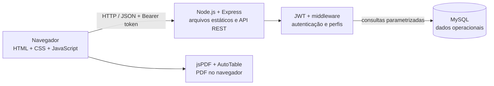
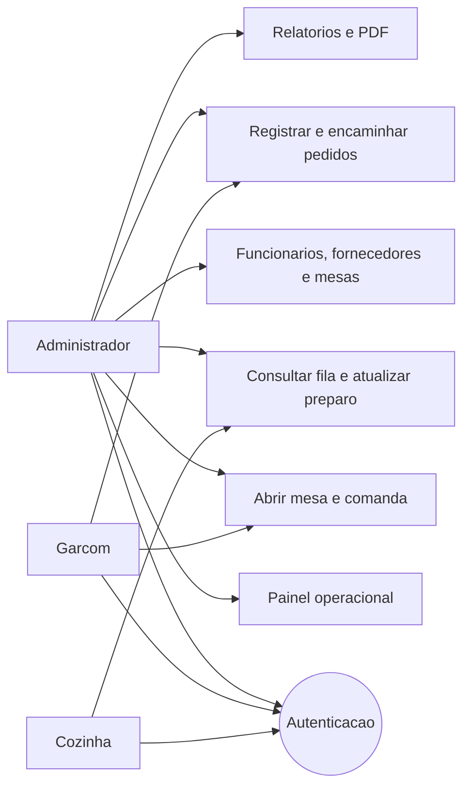
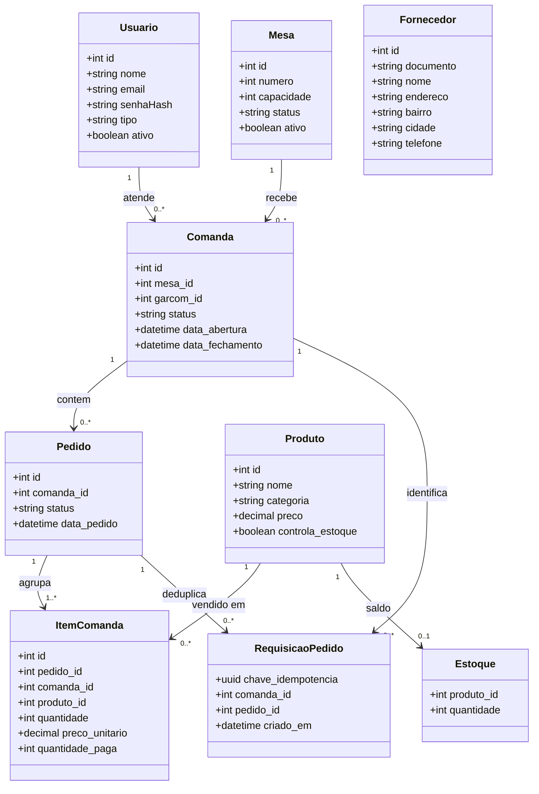
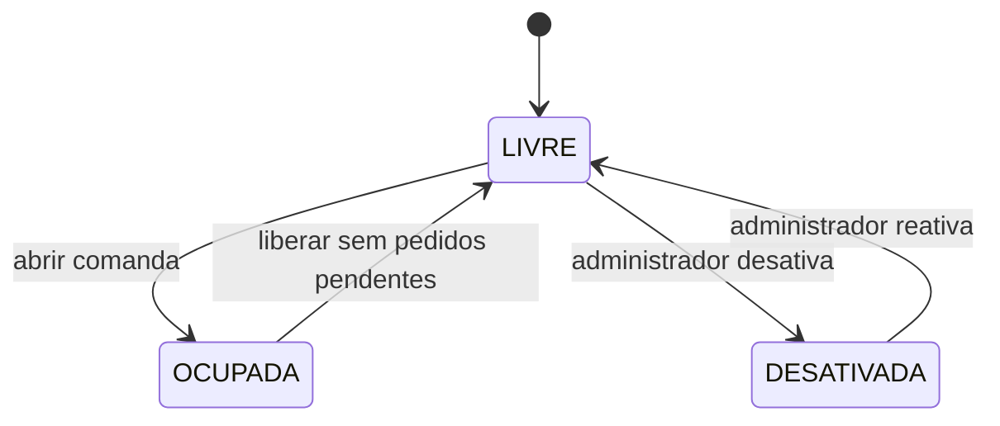
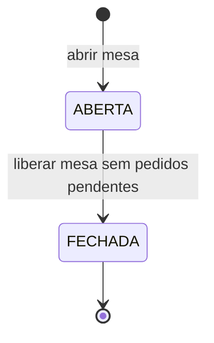
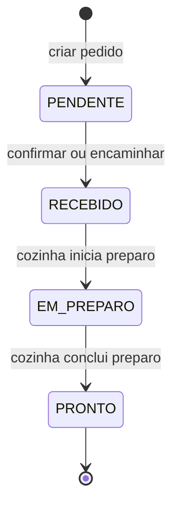
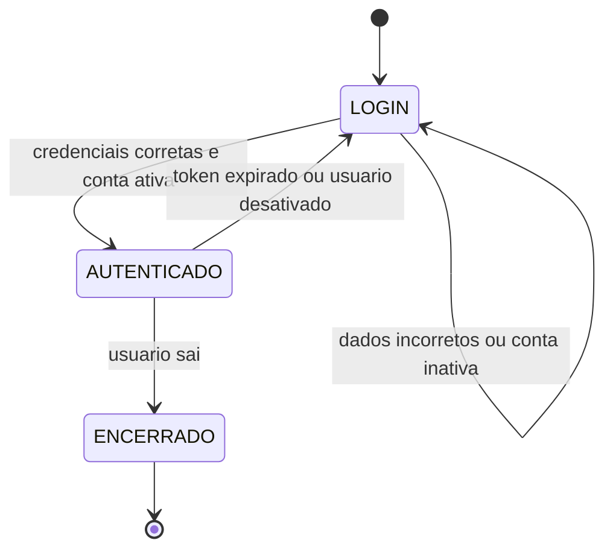
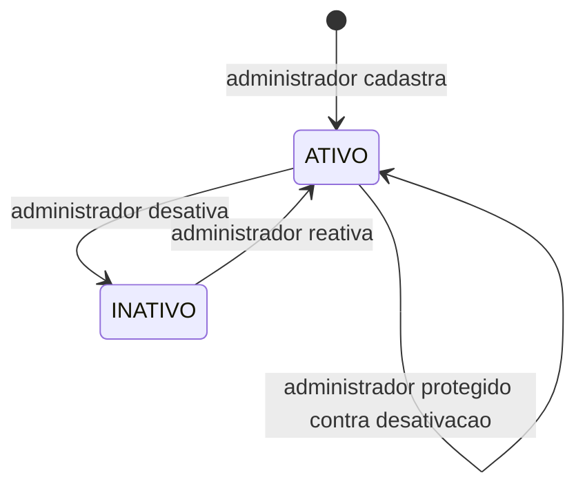
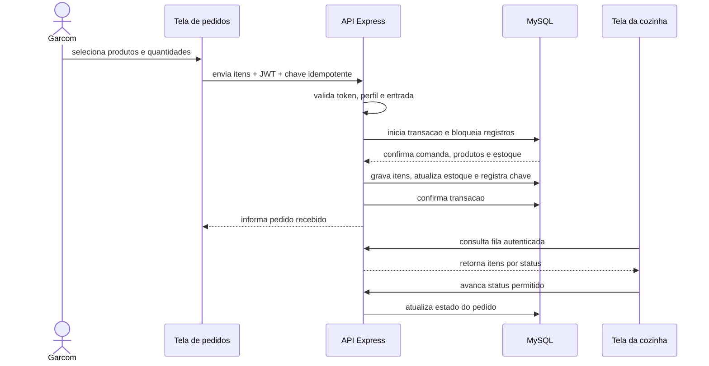

# Don Cabrón

### Gestão de restaurante: salão, pedidos, cozinha e administração em um só sistema

O **Don Cabrón** é uma aplicação web para organizar a operação diária de um restaurante. O sistema conecta os fluxos de atendimento, comandas, pedidos, produção na cozinha, cadastros e relatórios em uma interface única, com acesso controlado por perfil.

Desenvolvido como projeto acadêmico de Estágio Supervisionado, o projeto combina um front-end web sem framework, uma API REST e persistência em MySQL. A aplicação já cobre o fluxo operacional de mesas e pedidos; **não processa pagamentos nem oferece fechamento financeiro**.

> **Em uma frase:** do login ao pedido pronto, cada equipe enxerga as ferramentas adequadas à sua função e acompanha o trabalho em um fluxo compartilhado.

## O que o sistema faz

- Autentica funcionários e direciona cada perfil à sua área de trabalho.
- Mantém mesas, comandas abertas e itens consumidos organizados.
- Permite consultar produtos, montar pedidos e encaminhá-los à cozinha.
- Exibe a fila da cozinha por etapa e atualiza os pedidos automaticamente.
- Oferece ao administrador um painel com mesas ocupadas, produção e itens mais vendidos.
- Reúne relatórios operacionais por produto, garçom, mesa e período, com exportação em PDF.
- Centraliza cadastros de funcionários, fornecedores e mesas, além da consulta de estoque.

## Áreas do sistema

### Painel administrativo

O painel inicial do administrador reúne a visão da operação em uma data escolhida:

- mesas ocupadas, com comanda associada e total registrado até o momento;
- pedidos da cozinha separados por situação, com seus itens e mesa;
- ranking dos produtos mais vendidos no período selecionado;
- acesso rápido do cartão da mesa à respectiva tela de pedido;
- opção de dispensar da visualização do painel um pedido já pronto. Essa dispensação é apenas visual, armazenada no navegador; não altera o pedido no servidor.

O painel pode ser atualizado manualmente ou ao mudar a data. A atualização automática em intervalos de cinco segundos é do **painel da cozinha**, não do painel administrativo.

### Mesas e comandas

- Consulta de mesas e seus estados de ocupação e ativação.
- Cadastro de mesas com número e capacidade; o número duplicado é recusado.
- Abertura de uma comanda associada à mesa e ao funcionário responsável.
- Recuperação da comanda aberta e consulta dos seus itens.
- Edição, desativação e reativação administrativa de mesas, respeitando as regras de ocupação.
- Liberação da mesa quando não há pedidos pendentes, com encerramento da comanda aberta.

### Atendimento e pedidos

- Consulta do catálogo de produtos, categorias e preços cadastrados no banco.
- Seleção de produtos, edição de quantidades e composição do pedido da mesa.
- Inclusão de um ou vários itens e acompanhamento do pedido pendente.
- Confirmação/envio do pedido para a cozinha e consulta dos itens da comanda.
- Baixa de estoque para produtos marcados para controle de estoque, na mesma transação de inclusão dos itens. Atualmente, se a quantidade solicitada ultrapassar o saldo, a baixa é limitada a zero, mas o pedido não é bloqueado por falta de estoque.
- Proteção contra repetição acidental de uma solicitação por meio de chave de idempotência.

### Cozinha

A tela de produção organiza pedidos em três colunas:

1. **Recebidos** — aguardam início do preparo.
2. **Em preparo** — já estão sendo preparados.
3. **Prontos** — podem ser entregues no salão.

A tela consulta novamente a API a cada cinco segundos, mostra contadores e permite avançar o pedido somente para a próxima etapa válida. A equipe da cozinha pode atualizar os estados; a API também permite essas ações ao administrador.

### Usuários e fornecedores

- O administrador cadastra funcionários com nome, e-mail, senha e perfil de garçom ou cozinha.
- Consulta a lista de funcionários e ativa ou desativa contas.
- A conta do administrador não pode ser desativada pela rotina de funcionários.
- O cadastro de fornecedor registra documento, nome, endereço, bairro, cidade e telefone.
- A busca de fornecedores aceita nome ou documento. O back-end valida a quantidade de dígitos de CPF/CNPJ e telefone e rejeita documentos duplicados.

### Estoque e relatórios

- A tela/rota de estoque consulta quantidade por produto e categoria; não há, no momento, uma interface de movimentação manual de estoque.
- Relatórios administrativos permitem consultar:
  - quantidade e valor dos produtos registrados em pedidos;
  - volume de atendimentos por garçom;
  - quantidade de pedidos e valores por mesa, com ordenação;
  - visão consolidada para o período selecionado;
  - lista de garçons/administradores disponível como filtro.
- Os relatórios podem ser exportados para PDF com tabelas, período e identidade Don Cabrón.
- Os indicadores são calculados a partir dos pedidos e itens existentes. Não representam recebimentos, pagamentos confirmados ou conciliação financeira.

## Perfis de acesso

O perfil é atribuído ao usuário no cadastro e determina a navegação e a autorização no servidor.

| Perfil | Acesso e responsabilidades |
| --- | --- |
| `ADMIN` — Administrador | Acesso ao painel, relatórios, usuários, fornecedores, estoque, mesas, pedidos e tela da cozinha. Pode administrar funcionários e alterar, desativar ou reativar mesas. |
| `GARCOM` — Garçom | Acesso às telas de mesas e pedidos; consulta produtos, abre comandas, registra/encaminha pedidos e libera mesas conforme as regras de negócio. A permissão atual também permite consultar e cadastrar mesas. |
| `COZINHA` — Cozinha | Acesso à tela de produção, consulta pedidos e avança os estados de recebido para em preparo e de em preparo para pronto. |

O cadastro de novos usuários é feito por um administrador; não há fluxo público de auto cadastro. A restrição de páginas no navegador melhora a experiência, mas **a autorização efetiva é validada novamente pela API**.

## Fluxo operacional resumido

1. O funcionário entra com e-mail e senha.
2. O sistema valida a conta e encaminha o usuário para a área do seu perfil.
3. O garçom escolhe uma mesa e abre ou recupera sua comanda.
4. Os produtos e quantidades são registrados; o pedido segue para a cozinha.
5. A cozinha acompanha a fila e atualiza cada pedido até ficar pronto.
6. O salão consulta o estado e entrega o pedido. O administrador acompanha a operação e consulta relatórios.

Esse fluxo não inclui cobrança, pagamento ou fechamento financeiro da comanda.

## Segurança e integridade aplicadas

Os controles descritos abaixo estão implementados no código atual; eles não equivalem a uma certificação ou auditoria de segurança.

| Área | Controle implementado |
| --- | --- |
| Senhas | `bcryptjs` gera hash com fator de custo 10; a senha em texto puro não é armazenada nem retornada pela API. |
| Autenticação | Login emite JWT com validade de 8 horas. Rotas protegidas recebem o token no cabeçalho `Authorization: Bearer ...`. |
| Conta ativa | O middleware consulta novamente o usuário no banco em cada requisição protegida; conta inexistente ou desativada não continua autenticada. |
| Autorização | Middleware de perfil protege as rotas no servidor. Administrador, garçom e cozinha recebem permissões diferentes. |
| Sessão no navegador | Token e dados básicos do usuário ficam em `sessionStorage`; sair limpa esses dados. O token não persiste como sessão entre janelas/sessões do navegador. |
| Consultas ao banco | As entradas das consultas são parametrizadas com placeholders do MySQL; valores de ordenação são selecionados entre opções permitidas. |
| Validação | Há validação de campos, formatos, datas, identificadores inteiros positivos e regras de negócio no back-end. A inclusão em lote limita a solicitação a 100 itens. |
| Concorrência | Transações e bloqueios de linha são usados em operações críticas, como abertura de mesa/comanda e inclusão de itens, para manter alterações relacionadas consistentes. |
| Reenvio de pedidos | Chave de idempotência em formato UUID e restrição única evitam processar novamente a mesma solicitação. |
| Estoque | A alteração de estoque ocorre junto da inclusão do pedido em transação; produto sem controle de estoque não sofre baixa automática. |
| Restrições no banco | As migrações adicionam relacionamentos e regras para números/capacidades positivos, quantidades e saldo de estoque não negativo. |
| Superfície HTTP | O Express deixa de expor o cabeçalho `X-Powered-By`, limita JSON de entrada a 1 MB e aplica uma lista configurável de origens CORS para navegadores. |
| Erros de autenticação | Credenciais incorretas recebem uma mensagem genérica, sem diferenciar e-mail inexistente de senha incorreta. |

### Limites de segurança conhecidos

- A configuração padrão é local e usa HTTP; uma implantação pública precisa de HTTPS e configuração apropriada de proxy e origens.
- Não há limitação de tentativas de login, renovação de token, trilha de auditoria ou testes de segurança automatizados implementados.
- `sessionStorage` reduz a persistência do token, mas não protege contra execução de JavaScript malicioso na página.
- CORS não substitui autenticação ou autorização e não impede chamadas feitas fora do navegador.
- Configure `JWT_SECRET` com um segredo aleatório forte e não versionado. O arquivo `.env` é ignorado pelo Git.

## Identidade visual e experiência

A interface usa uma identidade inspirada na marca mexicana do restaurante, mantendo contraste e hierarquia entre as áreas de atendimento, administração e produção:

- **Paleta:** tons de vinho e vermelho (`#7a1f1f`, `#c4451c`) como base, laranja e dourado (`#e69a2e`, `#ff9d00`) nos destaques, com verde (`#2e7d32`) e azul (`#123c69`) como cores de apoio.
- **Tipografia:** Poppins, carregada do Google Fonts nas páginas que usam a tipografia compartilhada.
- **Marca e imagens:** logotipos para fundos claros e escuros, fotografia no login e imagens temáticas e de produtos na pasta `DonCabron/img`.
- **Temas:** modo escuro e claro em páginas compatíveis; a preferência de tema é guardada no `localStorage`.
- **Componentes:** navegação responsiva, cartões e listas operacionais, estados visuais de mesa/pedido, contadores e modais próprios para alertas e confirmações.
- **Painel:** cartões escuros, bordas e destaques dourados, hierarquia tipográfica e adaptação do grid para telas menores.
- **Relatórios:** PDFs com cabeçalho, tabelas e identificação da marca; valores são apresentados no formato monetário brasileiro quando aplicável.

## Tecnologias e linguagens

| Categoria | Tecnologia | Uso |
| --- | --- | --- |
| Linguagem de interface | HTML5 | Estrutura das páginas e formulários. |
| Estilos | CSS3 | Temas, layouts responsivos, componentes e identidade visual. |
| Linguagem de aplicação | JavaScript ES6+ | Interações no navegador e lógica do servidor; o back-end usa módulos CommonJS. |
| Plataforma de execução | Node.js | Execução do servidor JavaScript. |
| Servidor/API | Express 5 | Servir arquivos estáticos e fornecer endpoints REST/JSON. |
| Banco de dados | MySQL | Persistência relacional dos dados operacionais. |
| Driver de banco | `mysql2` | Pool de conexões e consultas assíncronas (`mysql2/promise`). |
| Autenticação | `jsonwebtoken` | Assinatura e validação de tokens JWT. |
| Proteção de senha | `bcryptjs` | Geração e comparação de hashes de senha. |
| Configuração | `dotenv` | Carregamento de variáveis de ambiente. |
| Cross-origin | `cors` | Política de origens permitidas para requisições do navegador. |
| Migrações | SQL | Ajustes incrementais de chaves, relacionamentos e restrições do banco. |
| Documentação visual | Mermaid | Diagramas renderizados diretamente por plataformas compatíveis, como o GitHub. |
| PDF | jsPDF 2.5.1 e jsPDF-AutoTable 3.8.2 | Geração de relatórios no navegador, carregada por CDN nas páginas de relatórios. |
| Fonte web | Poppins / Google Fonts | Tipografia visual das páginas. |

As dependências do servidor estão declaradas em [`DonCabron/BackEnd/package.json`](./DonCabron/BackEnd/package.json). O front-end é JavaScript sem framework: não usa React, Vue ou Angular.

## Arquitetura


```mermaid
flowchart LR
    Navegador["Navegador<br/>HTML + CSS + JavaScript"]
    Express["Node.js + Express<br/>arquivos estáticos e API REST"]
    Auth["JWT + middleware<br/>autenticação e perfis"]
    MySQL[("MySQL<br/>dados operacionais")]
    PDF["jsPDF + AutoTable<br/>PDF no navegador"]

    Navegador -->|"HTTP / JSON + Bearer token"| Express
    Express --> Auth
    Auth -->|"consultas parametrizadas"| MySQL
    Navegador --> PDF
```

## Diagramas de funcionalidades e dados

### Casos de uso por perfil


```mermaid
flowchart LR
    Admin[Administrador]
    Garcom[Garcom]
    Cozinha[Cozinha]
    Login((Autenticacao))
    Painel[Painel operacional]
    Cadastros[Funcionarios, fornecedores e mesas]
    Relatorios[Relatorios e PDF]
    Atendimento[Abrir mesa e comanda]
    Pedido[Registrar e encaminhar pedidos]
    Produzir[Consultar fila e atualizar preparo]

    Admin --> Login
    Garcom --> Login
    Cozinha --> Login
    Admin --> Painel
    Admin --> Cadastros
    Admin --> Relatorios
    Admin --> Atendimento
    Admin --> Pedido
    Admin --> Produzir
    Garcom --> Atendimento
    Garcom --> Pedido
    Cozinha --> Produzir
```

### Diagrama de classes / modelo conceitual

O diagrama representa as entidades usadas pelos fluxos atuais. `ItemComanda` relaciona produto, pedido e comanda; estoque tem no máximo um saldo por produto após a migração correspondente. Relatórios são consultas, não uma entidade persistida.


```mermaid
classDiagram
    class Usuario {
        +int id
        +string nome
        +string email
        +string senhaHash
        +string tipo
        +boolean ativo
    }
    class Mesa {
        +int id
        +int numero
        +int capacidade
        +string status
        +boolean ativo
    }
    class Comanda {
        +int id
        +int mesa_id
        +int garcom_id
        +string status
        +datetime data_abertura
        +datetime data_fechamento
    }
    class Pedido {
        +int id
        +int comanda_id
        +string status
        +datetime data_pedido
    }
    class ItemComanda {
        +int id
        +int pedido_id
        +int comanda_id
        +int produto_id
        +int quantidade
        +decimal preco_unitario
        +int quantidade_paga
    }
    class Produto {
        +int id
        +string nome
        +string categoria
        +decimal preco
        +boolean controla_estoque
    }
    class Estoque {
        +int produto_id
        +int quantidade
    }
    class Fornecedor {
        +int id
        +string documento
        +string nome
        +string endereco
        +string bairro
        +string cidade
        +string telefone
    }
    class RequisicaoPedido {
        +uuid chave_idempotencia
        +int comanda_id
        +int pedido_id
        +datetime criado_em
    }

    Usuario "1" --> "0..*" Comanda : atende
    Mesa "1" --> "0..*" Comanda : recebe
    Comanda "1" --> "0..*" Pedido : contem
    Pedido "1" --> "1..*" ItemComanda : agrupa
    Produto "1" --> "0..*" ItemComanda : vendido em
    Produto "1" --> "0..1" Estoque : saldo
    Comanda "1" --> "0..*" RequisicaoPedido : identifica
    Pedido "1" --> "0..*" RequisicaoPedido : deduplica
```

`Fornecedor` é mostrado separadamente porque não há relacionamento fornecedor-produto aplicado pelos fluxos atuais. O esquema de itens de pagamento aparece em restrições de banco, mas não existe fluxo de cobrança/pagamento implementado na aplicação.

## Diagramas de estado

### Mesa

`DESATIVADA` é a representação de interface para uma mesa inativa (`ativo = 0`); o banco também mantém o campo `status` de ocupação.


```mermaid
stateDiagram-v2
    [*] --> LIVRE
    LIVRE --> OCUPADA: abrir comanda
    OCUPADA --> LIVRE: liberar sem pedidos pendentes
    LIVRE --> DESATIVADA: administrador desativa
    DESATIVADA --> LIVRE: administrador reativa
```

### Comanda


```mermaid
stateDiagram-v2
    [*] --> ABERTA: abrir mesa
    ABERTA --> FECHADA: liberar mesa sem pedidos pendentes
    FECHADA --> [*]
```

### Pedido e produção


```mermaid
stateDiagram-v2
    [*] --> PENDENTE: criar pedido
    PENDENTE --> RECEBIDO: confirmar ou encaminhar
    RECEBIDO --> EM_PREPARO: cozinha inicia preparo
    EM_PREPARO --> PRONTO: cozinha conclui preparo
    PRONTO --> [*]
```

### Autenticação e sessão


```mermaid
stateDiagram-v2
    [*] --> LOGIN
    LOGIN --> AUTENTICADO: credenciais corretas e conta ativa
    LOGIN --> LOGIN: dados incorretos ou conta inativa
    AUTENTICADO --> ENCERRADO: usuario sai
    AUTENTICADO --> LOGIN: token expirado ou usuario desativado
    ENCERRADO --> [*]
```

### Ativação de funcionário


```mermaid
stateDiagram-v2
    [*] --> ATIVO: administrador cadastra
    ATIVO --> INATIVO: administrador desativa
    INATIVO --> ATIVO: administrador reativa
    ATIVO --> ATIVO: administrador protegido contra desativacao
```

### Sequência: pedido do salão à cozinha


```mermaid
sequenceDiagram
    actor Garcom
    participant Tela as Tela de pedidos
    participant API as API Express
    participant Banco as MySQL
    participant Cozinha as Tela da cozinha

    Garcom->>Tela: seleciona produtos e quantidades
    Tela->>API: envia itens + JWT + chave idempotente
    API->>API: valida token, perfil e entrada
    API->>Banco: inicia transacao e bloqueia registros
    Banco-->>API: confirma comanda, produtos e estoque
    API->>Banco: grava itens, atualiza estoque e registra chave
    API->>Banco: confirma transacao
    API-->>Tela: informa pedido recebido
    Cozinha->>API: consulta fila autenticada
    API-->>Cozinha: retorna itens por status
    Cozinha->>API: avanca status permitido
    API->>Banco: atualiza estado do pedido
```

## API REST

Base local: `http://localhost:3000`. Rotas de dados protegidas exigem token Bearer; as permissões dependem do perfil.

| Área | Rotas disponíveis |
| --- | --- |
| Autenticação e funcionários | `POST /auth/login`; `GET /auth/usuarios`; `POST /auth/usuarios`; `PATCH /auth/usuarios/:id/status` |
| Produtos e estoque | `GET /produtos`; `GET /estoque` |
| Fornecedores | `GET /fornecedores?busca=`; `POST /fornecedores` |
| Mesas | `GET /mesas`; `GET /mesas/todas`; `POST /mesas`; `PUT /mesas/:id`; `PATCH /mesas/:id/desativar`; `PATCH /mesas/:id/reativar`; `POST /mesas/:id/abrir`; `POST /mesas/:id/liberar-sem-pedidos` |
| Comandas e itens | `POST /comandas`; `POST /comandas/:comanda_id/itens`; `GET /comandas/:comanda_id/pedido-pendente`; `PUT /comandas/:comanda_id/pedido/:pedido_id/confirmar`; `GET /mesas/:id/comanda`; `GET /mesas/:id/comanda/itens` |
| Cozinha | `GET /comandas/cozinha/pedidos`; `PUT /comandas/cozinha/pedido/:pedido_id/preparo`; `PUT /comandas/cozinha/pedido/:pedido_id/pronto` |
| Relatórios | `GET /relatorios/painel`; `GET /relatorios/produtos`; `GET /relatorios/atendimentos`; `GET /relatorios/garcons`; `GET /relatorios/mesas`; `GET /relatorios/consolidado` |

## Executar localmente

### Pré-requisitos

- Node.js e npm.
- MySQL acessível.
- Banco previamente criado com as tabelas usadas pela aplicação. O repositório não inclui uma migração inicial completa nem dados de demonstração.

### Instalação e configuração

1. Instale as dependências e inicie o servidor:

   ```powershell
   cd DonCabron\BackEnd
   npm install
   node server.js
   ```

2. Configure estas variáveis no ambiente do servidor, ou em `DonCabron/BackEnd/.env`:

   ```dotenv
   DB_HOST=localhost
   DB_USER=seu_usuario
   DB_PASSWORD=sua_senha
   DB_NAME=don_cabron
   DB_PORT=3306
   JWT_SECRET=gere_uma_chave_aleatoria_forte
   FRONTEND_ORIGINS=http://localhost:3000,http://127.0.0.1:3000,http://localhost:5500,http://127.0.0.1:5500
   ```

   `FRONTEND_ORIGINS` é opcional. Quando omitida, o servidor usa as quatro origens locais mostradas acima. Ajuste a lista para o endereço real do front-end; a configuração CORS não é controle de acesso à API.

3. Em um banco existente, aplique uma única vez as migrações ainda não executadas, nesta ordem:

   - [`001_adiciona_garcom_na_comanda.sql`](./DonCabron/BackEnd/migrations/001_adiciona_garcom_na_comanda.sql)
   - [`002_requisicoes_pedido.sql`](./DonCabron/BackEnd/migrations/002_requisicoes_pedido.sql)
   - [`003_regras_de_quantidade.sql`](./DonCabron/BackEnd/migrations/003_regras_de_quantidade.sql)

   A terceira migração exige MySQL 8.0.16 ou superior e dados compatíveis com as restrições; confira duplicidades e valores inválidos e faça backup antes de executá-la.

4. Acesse [`http://localhost:3000/DonCabron/index/login.html`](http://localhost:3000/DonCabron/index/login.html). O login depende de uma conta existente na tabela de usuários; não há credenciais padrão no repositório.

O servidor Express entrega as páginas, estilos, imagens e scripts estáticos e expõe a API na porta `3000`. As credenciais reais devem permanecer no `.env`, que é ignorado pelo Git. O projeto ainda não fornece um comando de inicialização `npm start` nem uma suíte de testes configurada.

## Estrutura do repositório

```text
.
|-- README.md
|-- .gitignore
|-- js/                         # lógica do navegador
|-- DonCabron/
    |-- BackEnd/
    |   |-- config/             # pool MySQL
    |   |-- middleware/         # autenticação, perfis e validação
    |   |-- migrations/         # ajustes incrementais do banco
    |   |-- routes/             # endpoints REST por domínio
    |   |-- server.js
    |   |-- package.json
    |-- css/                    # estilos por tela e componentes
    |-- img/                    # logos, fundos e imagens de produtos
    |-- index/                  # páginas HTML
```

## Estado atual e próximos passos

**Já implementado:** autenticação com perfis, gestão operacional de mesas e comandas, pedidos e cozinha, consulta e baixa automática de estoque controlado, cadastros, painel administrativo e relatórios em PDF.

**Ainda não implementado:** cobrança e integração com meios de pagamento, fluxo de fechamento financeiro, histórico de pagamentos, auditoria de ações, renovação de sessão e suíte de testes automatizados. O fechamento da mesa sem pedidos pendentes encerra a comanda operacional, mas não registra pagamento.

O projeto é uma base funcional para operação local e demonstra integração entre atendimento, produção e administração. Para uso público/produção, configure HTTPS, segredos e origens adequados, prepare o banco, revise os controles de segurança e valide os fluxos em um ambiente de homologação.
