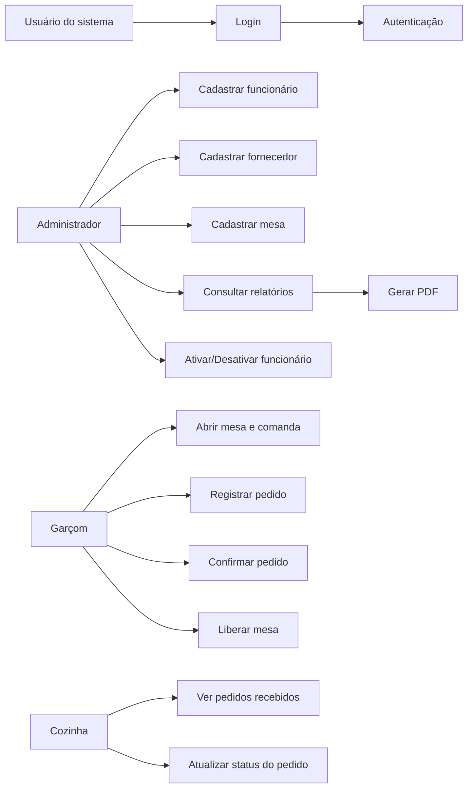
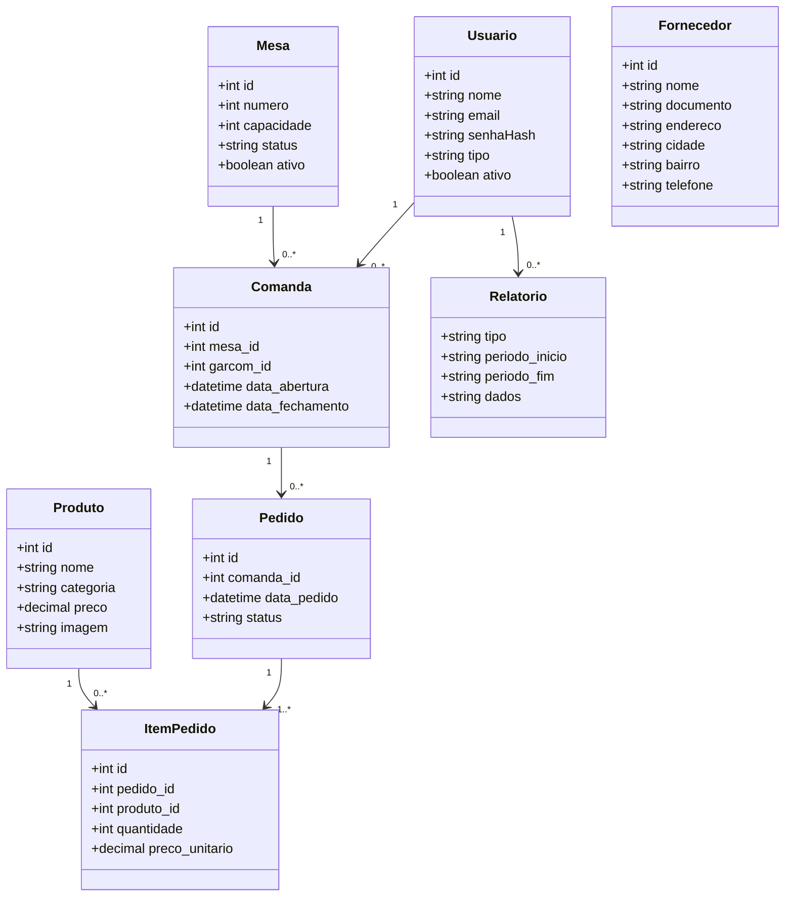
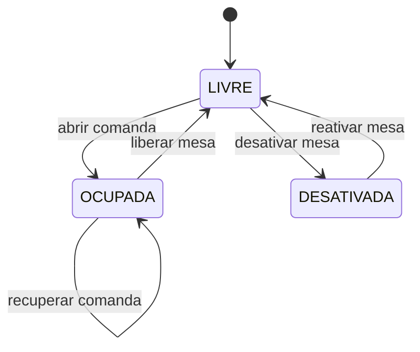
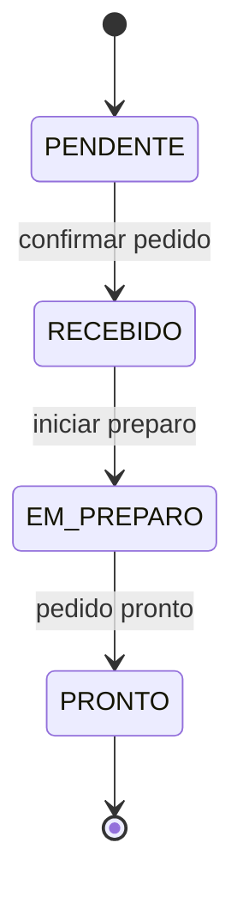
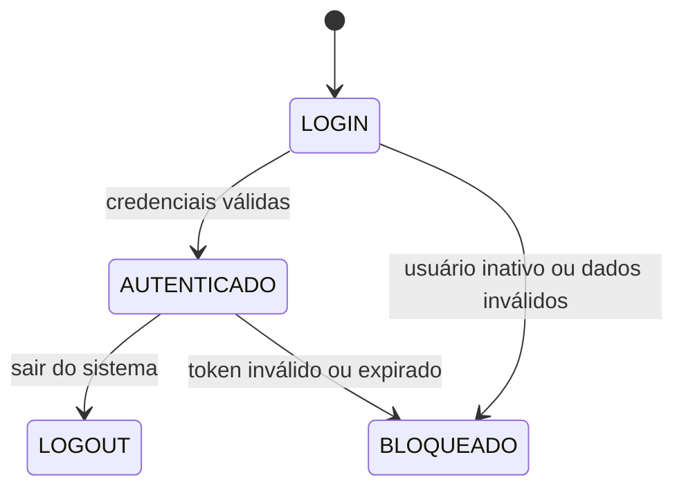

# Don Cabrón — Sistema de Gestão para Restaurante

Aplicação web para gestão operacional de restaurante, desenvolvida como projeto acadêmico de Estágio Supervisionado. O sistema integra administração, atendimento, cozinha e relatórios em uma solução completa com API REST em Node.js/Express, banco MySQL e front-end em HTML, CSS e JavaScript puro.

## Visão geral

O Don Cabrón foi pensado para controlar o ciclo operacional do restaurante, desde a abertura da mesa até a liberação da comanda, passando por cadastro de clientes internos (mesas), funcionários, fornecedores, gestão de produtos e acompanhamento dos pedidos na cozinha.

A solução atual já oferece:

- autenticação por perfil e autorização por regra de acesso;
- gestão de mesas e comandas;
- criação e confirmação de pedidos;
- acompanhamento em tempo real da cozinha;
- relatórios operacionais com exportação para PDF;
- gestão administrativa de usuários e fornecedores;
- interface responsiva com melhoria visual por modal interativo.

## Stack tecnológica

| Camada | Implementação |
| --- | --- |
| Front-end | HTML5, CSS3 e JavaScript ES6+ |
| Back-end | Node.js + Express |
| Persistência | MySQL com `mysql2/promise` |
| API | REST/JSON |
| Segurança | JWT, bcryptjs, validação de perfil e bloqueio por sessão |
| Relatórios | jsPDF + AutoTable |
| UI/UX | tema claro/escuro, menu responsivo e modais personalizados |

## Funcionalidades implementadas atualmente

### 1. Autenticação e autorização

- Login de usuários com validação de e-mail e senha;
- geração e uso de JWT para autenticação;
- bloqueio de páginas e endpoints conforme perfil de acesso;
- proteção de rotas administrativas e de relatórios;
- usuários inativos não podem autenticar;
- logout por ação do usuário e limpeza de dados sensíveis da sessão.

Perfis suportados:

- `ADMIN`: acesso completo a cadastros, relatórios e operações administrativas;
- `GARCOM`: acesso a mesas, abertura de comandas e pedidos;
- `COZINHA`: acesso ao painel de produção e alteração de status dos pedidos.

### 2. Cadastro e gestão de usuários

- cadastro de funcionários com nome, e-mail, senha e função;
- listagem de usuários ativos e inativos;
- ativação e desativação de funcionários;
- controle de acesso por perfil;
- validação de campos obrigatórios;
- bloqueio de ações sem autenticação válida.

### 3. Gestão de mesas e comandas

- cadastro de mesas com número e capacidade;
- alteração de dados da mesa;
- desativação e reativação de mesas;
- abertura de comanda associada à mesa;
- recuperação da comanda aberta;
- liberação de mesa sem pedidos;
- controle de status da mesa (`LIVRE`, `OCUPADA`, `DESATIVADA`);
- prevenção de acesso indevido a mesas desativadas.

### 4. Pedidos e atendimento

- listagem do cardápio com categorias e preços;
- seleção de produtos por mesa;
- montagem do pedido atual em memória no cliente;
- aumento e diminuição da quantidade de itens;
- confirmação do pedido e envio para a cozinha;
- reforço de segurança para não confirmar pedidos vazios;
- atualização de itens já enviados na comanda.

### 5. Cozinha

- painel de cozinha com separação por status:
  - Recebidos;
  - Em preparo;
  - Prontos;
- atualização automática do quadro;
- botão para iniciar preparo;
- botão para marcar pedido como pronto;
- contadores por coluna para acompanhamento visual;
- validação do status antes da alteração;
- bloqueio de ações sem sessão válida.

### 6. Fornecedores

- cadastro de fornecedor com nome, endereço, bairro, cidade e telefone;
- validação de CPF ou CNPJ;
- prevenção de documentos duplicados;
- pesquisa por nome, CPF ou CNPJ;
- listagem dos registros encontrados;
- mensagens amigáveis por modal para feedback visual.

### 7. Relatórios

- relatório de itens mais vendidos;
- relatório de atendimentos por garçom;
- relatório de rendimento por mesa;
- relatório consolidado de vendas por período;
- filtros por data e seleção de item/garçom/mesa;
- exportação para PDF com tabelas e cabeçalho da marca;
- exibição de valores monetários em real;
- controle de períodos inválidos e ausência de dados.

### 8. Experiência visual e interface

- menu responsivo;
- tema claro/escuro;
- navegação por páginas do sistema;
- modais personalizados substituindo `alert()`, `confirm()` e `prompt()`;
- feedback visual melhorado para erros, confirmações e operações bem-sucedidas;
- usabilidade mais elegante e consistente em toda a aplicação.

## Regras de negócio implementadas

- número da mesa deve ser único;
- documento do fornecedor deve ser único;
- mesa ativa e livre pode ser aberta;
- a abertura de mesa cria a comanda associada;
- mesas ocupadas não podem ser editadas ou desativadas;
- pedidos devem possuir itens válidos antes do envio;
- um pedido só é confirmado se houver itens na comanda;
- o fluxo da cozinha não permite pular etapas de status;
- funcionários inativos não podem autenticar;
- apenas administradores podem gerenciar usuários;
- relatórios exigem filtros válidos e datas consistentes;
- a comanda não pode ser liberada se houver pedidos confirmados pendentes.

## Segurança aplicada

| Controle | Implementação atual |
| --- | --- |
| autenticação | JWT emitido no login e validado pelo middleware de autenticação |
| hash de senha | `bcryptjs` para armazenamento e comparação das senhas |
| autorização | middleware de perfil com validação de permissões por rota |
| proteção do cliente | páginas e menus limitados conforme perfil do usuário |
| proteção do servidor | rotas sensíveis verificam token e perfil antes da execução |
| validação de entrada | campos obrigatórios, tamanho, formato e regras de negócio no back-end |
| SQL injection | uso de queries parametrizadas com placeholders no MySQL |
| sessão do navegador | token e dados mínimos do usuário em `sessionStorage` |
| minimização de dados | informações sensíveis como senha nunca são retornadas na resposta da API |
| expiração de sessão | acesso bloqueado após ausência de token ou autenticação inválida |
| integridade operacional | controle de abertura de mesa/comanda e regras de transição de status |
| feedback ao usuário | mensagens de erro e confirmação em modal, sem expor dados críticos por alertas nativos |

### Regras de segurança relevantes

- O sistema não deve expor senhas em JSON, console ou HTML;
- somente o token e o identificador mínimo do usuário devem permanecer no navegador;
- ações administrativas precisam de perfil `ADMIN`;
- interceptação indevida de sessão é evitada por validação JWT;
- todo endpoint que altera dados valida permissões antes de operar;
- dados de relatórios são liberados apenas para usuários autenticados com perfil adequado.

## Minimização e limite de dados permitidos

O sistema adota a política de coleta mínima de dados necessária para execução do restaurante:

- dados do usuário: nome, e-mail, tipo e status;
- dados da mesa: número e capacidade;
- dados da comanda: identificação, horário de abertura e garçom responsável;
- dados do fornecedor: documento, nome, endereço, bairro, cidade e telefone;
- dados do produto: nome, descrição, categoria, preço, imagem e controle de estoque quando aplicável;
- dados do pedido: itens, quantidade, valor e status.

Não são armazenados ou expostos:

- senhas em texto puro;
- dados financeiros completos de cartão ou pagamento;
- dados sensíveis além do que é exigido para operação;
- informações extras que não participam do fluxo do restaurante.

## Estrutura do projeto

```text
.
├── DonCabron/
│   ├── BackEnd/
│   │   ├── config/
│   │   ├── middleware/
│   │   ├── migrations/
│   │   ├── routes/
│   │   └── server.js
│   ├── css/
│   ├── img/
│   ├── index/
│   └── README.md
├── js/
├── .gitignore
├── README.md
└── .git/
```

## Endpoints principais da API

Base local: `http://localhost:3000`

| Área | Endpoints principais |
| --- | --- |
| login e usuários | `POST /auth/login`, `GET /auth/usuarios`, `POST /auth/usuarios`, `PATCH /auth/usuarios/:id/status` |
| produtos | `GET /produtos` |
| estoque | `GET /estoque` |
| fornecedores | `GET /fornecedores?busca=`, `POST /fornecedores` |
| mesas | `GET /mesas`, `POST /mesas`, `PUT /mesas/:id`, `PATCH /mesas/:id/desativar`, `PATCH /mesas/:id/reativar`, `POST /mesas/:id/abrir`, `POST /mesas/:id/liberar-sem-pedidos` |
| comandas e itens | `POST /comandas/:id/itens`, `GET /comandas/:id/pedido-pendente`, `PUT /comandas/:id/pedido/:pedidoId/confirmar`, `GET /mesas/:id/comanda/itens` |
| cozinha | `GET /comandas/cozinha/pedidos`, `PUT /comandas/cozinha/pedido/:id/preparo`, `PUT /comandas/cozinha/pedido/:id/pronto` |
| relatórios | `GET /relatorios/produtos`, `GET /relatorios/atendimentos`, `GET /relatorios/mesas`, `GET /relatorios/consolidado`, `GET /relatorios/garcons` |

## Diagrama de caso de uso


```mermaid
flowchart LR
    Usuario[Usuário do sistema]
    Admin[Administrador]
    Garcom[Garçom]
    Cozinha[Cozinha]

    Usuario --> Login[Login]
    Login --> Autenticacao[Autenticação]

    Admin --> CadastroUsuario[Cadastrar funcionário]
    Admin --> CadastroFornecedor[Cadastrar fornecedor]
    Admin --> CadastroMesa[Cadastrar mesa]
    Admin --> Relatorios[Consultar relatórios]
    Admin --> AtivarFuncionario[Ativar/Desativar funcionário]

    Garcom --> AbrirMesa[Abrir mesa e comanda]
    Garcom --> FazerPedido[Registrar pedido]
    Garcom --> ConfirmarPedido[Confirmar pedido]
    Garcom --> LiberarMesa[Liberar mesa]

    Cozinha --> VisualizarPedidos[Ver pedidos recebidos]
    Cozinha --> AtualizarStatus[Atualizar status do pedido]

    Relatorios --> ExportarPDF[Gerar PDF]
```

## Diagrama de classes


```mermaid
classDiagram
    class Usuario {
        +int id
        +string nome
        +string email
        +string senhaHash
        +string tipo
        +boolean ativo
    }

    class Mesa {
        +int id
        +int numero
        +int capacidade
        +string status
        +boolean ativo
    }

    class Comanda {
        +int id
        +int mesa_id
        +int garcom_id
        +datetime data_abertura
        +datetime data_fechamento
    }

    class Pedido {
        +int id
        +int comanda_id
        +datetime data_pedido
        +string status
    }

    class ItemPedido {
        +int id
        +int pedido_id
        +int produto_id
        +int quantidade
        +decimal preco_unitario
    }

    class Produto {
        +int id
        +string nome
        +string categoria
        +decimal preco
        +string imagem
    }

    class Fornecedor {
        +int id
        +string nome
        +string documento
        +string endereco
        +string cidade
        +string bairro
        +string telefone
    }

    class Relatorio {
        +string tipo
        +string periodo_inicio
        +string periodo_fim
        +string dados
    }

    Usuario "1" --> "0..*" Comanda
    Mesa "1" --> "0..*" Comanda
    Comanda "1" --> "0..*" Pedido
    Pedido "1" --> "1..*" ItemPedido
    Produto "1" --> "0..*" ItemPedido
    Usuario "1" --> "0..*" Relatorio
```

## Diagramas de estado

### Fluxo de mesa e comanda


```mermaid
stateDiagram-v2
    [*] --> LIVRE
    LIVRE --> OCUPADA: abrir comanda
    OCUPADA --> LIVRE: liberar mesa
    LIVRE --> DESATIVADA: desativar mesa
    DESATIVADA --> LIVRE: reativar mesa
    OCUPADA --> OCUPADA: recuperar comanda
```

### Fluxo de pedido e cozinha


```mermaid
stateDiagram-v2
    [*] --> PENDENTE
    PENDENTE --> RECEBIDO: confirmar pedido
    RECEBIDO --> EM_PREPARO: iniciar preparo
    EM_PREPARO --> PRONTO: pedido pronto
    PRONTO --> [*]
```

### Fluxo de autenticação


```mermaid
stateDiagram-v2
    [*] --> LOGIN
    LOGIN --> AUTENTICADO: credenciais válidas
    LOGIN --> BLOQUEADO: usuário inativo ou dados inválidos
    AUTENTICADO --> LOGOUT: sair do sistema
    AUTENTICADO --> BLOQUEADO: token inválido ou expirado
```

## Implementações recentes

### Melhorias de UX no frontend

- substituição de `alert()`, `confirm()` e `prompt()` por um modal visual padronizado;
- mensagens mais legíveis e consistentes em todas as telas;
- melhor feedback em operações importantes como login, alteração de mesa, confirmação de pedidos e geração de PDF;
- interface mais profissional e intuitiva para o usuário final.

## Status atual do projeto

O sistema está funcional e operacional para o uso interno da gestão do restaurante, com módulos de autenticação, comandas, cozinha, relatórios, fornecedores e cadastros. As próximas evoluções previstas incluem:

- fechamento financeiro de comandas;
- baixa automatizada de estoque;
- histórico de pagamento e fechamento;
- auditoria de ações administrativas;
- testes automatizados;
- reforço de segurança com expiração/renovação de sessão e cabeçalhos HTTP mais restritivos.

## Conclusão

O Don Cabrón é uma solução prática de gestão de restaurante com foco em operação, controle e desempenho. Ele integra os principais fluxos do negócio em uma plataforma simples, segura e fácil de operar, com suporte à tomada de decisão por meio de relatórios e acompanhamento em tempo real da cozinha.
